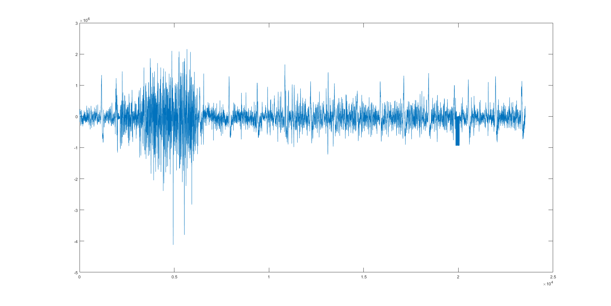
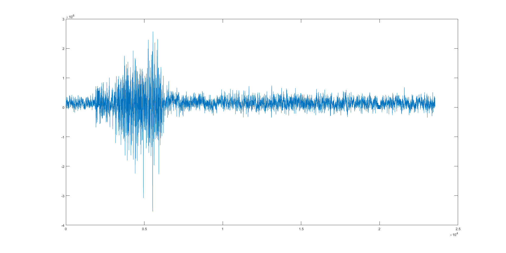
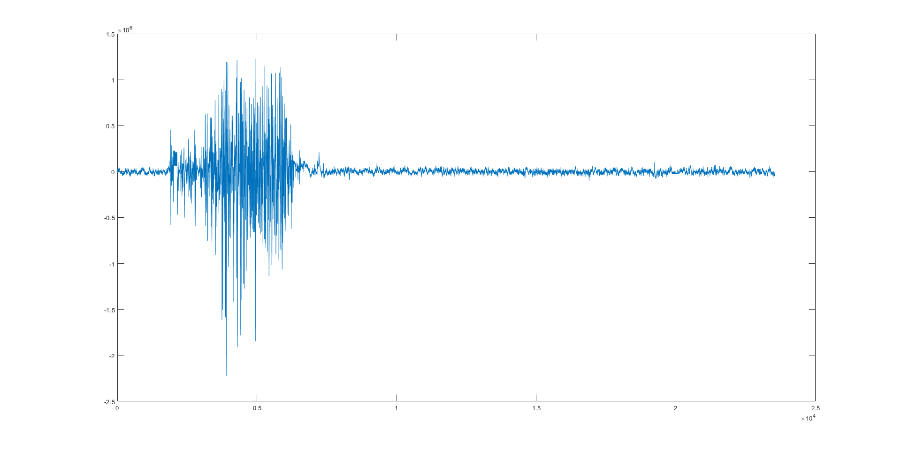

# EMG-denoising
Functions to denoise High Density EMG signals.

## Table of Contents
* [EMG Contamination](#EMG-Contamination)
* [Movement artifact, PLI, WGI contamination](#Movement-artifact,-PLI,-WGI-contamination)
* [Technologies](#Technologies)
* [Setup](#Setup)
* [Sources](#Sources)

## EMG Contamination
This ECG-artifact filter is based on the paper Mak, J. N., Hu, Y., & Luk, K. D. (2010). An automated ECG-artifact removal method for trunk muscle surface EMG recordings. Medical engineering & physics, 32(8), 840-848. DOI: 10.1016/j.medengphy.2010.05.007 and on "Rectification and non-linear pre-processing of EMG signals for cortico-muscular analysis." from Myers et al. DOI: 10.1016/s0165-0270(03)00004-9 for the pre-processing of the HD EMG.

The following function remove ECG contamination from High Density EMG signals. This is the matlab implementation of the work described in "Mak, J. N., Hu, Y., & Luk, K. D. (2010). An automated ECG-artifact removal method for trunk muscle surface EMG recordings. Medical engineering & physics, 32(8), 840-848." With the following changes:
- A moving average filter has been added to the pre processing step in order to smooth out potential artifacts on the ECG ICA component that could appear in field conditions. Those artifact would be detected as potential ECG spike and would teherefor make the component fail the RR interval check.
- To improve reliability of the RR interval check, it had been added a 10% margin of error, meaning at least 90% of the peak of the tested component should meet the RR interval check requirement.

### Example
Before:

After:

### Principle
- Hilbert transform
- Median filter (order 50)
- Moving average filter (5% of the acquisiton frequency) /!\ this is an empirical addon in order to make the filter work in field condition /!\
- FastICA to take out the different signal sources
- Detection of the ECG sources
- Separation of the EMG and ECG sources and reconstruction of the signals

## Movement artifact, PLI, WGI contamination
This filter remove movement artifact, power line interference and white gaussian noise. It is based on the paper "Al Harrach, M., Boudaoud, S., Hassan, M., Ayachi, F. S., Gamet, D., Grosset, J. F., & Marin, F. (2017). Denoising of HD-sEMG signals using canonical correlation analysis. Medical & biological engineering & computing, 55(3), 375-388."

/!\ WARNING /!\\

If your HD EMG signals are contaminated by ECG artifacts, it is vividely recommended to filter them out first before using this filter. Indeed the chance of successful use dramatically lower if there is ECG contamination of the signals.

### Example
Before:

After:

### Principle
- Canonical Correlation Analysis to extract linear combination of the HD EMG signals (CCA components)
- Selection of the noisy components to filter via the use of an intensity ratio
- Correlation analysis between filtered and unfiltered signals to keep the maximum EMG information
- Selective CCA step, where filtered and unfiltered channels PNR is compared. The one with highest PNR is choosen to be kept for the final filtered EMG matrix. This is done in order to prevent noise contamination of the high PNR channel due to signals reconstruction

## Technologies
The project has been developped on MATLAB 2018a 9.4.0.813654, on windows 10 64 bits.

## Setup
The filters are matlab function, to run them, just download them then add them to your matlab path.

## Sources
- Al Harrach, M., Boudaoud, S., Hassan, M., Ayachi, F. S., Gamet, D., Grosset, J. F., & Marin, F. (2017). Denoising of HD-sEMG signals using canonical correlation analysis. Medical & biological engineering & computing, 55(3), 375-388. DOI: 10.1007/s11517-016-1521-x
- Mak, J. N., Hu, Y., & Luk, K. D. (2010). An automated ECG-artifact removal method for trunk muscle surface EMG recordings. Medical engineering & physics, 32(8), 840-848. DOI: 10.1016/j.medengphy.2010.05.007
- Myers, L. J., Lowery, M., O'malley, M., Vaughan, C. L., Heneghan, C., Gibson, A. S. C., ... & Sreenivasan, R. (2003). Rectification and non-linear pre-processing of EMG signals for cortico-muscular analysis. Journal of neuroscience methods, 124(2), 157-165. DOI: 10.1016/s0165-0270(03)00004-9

